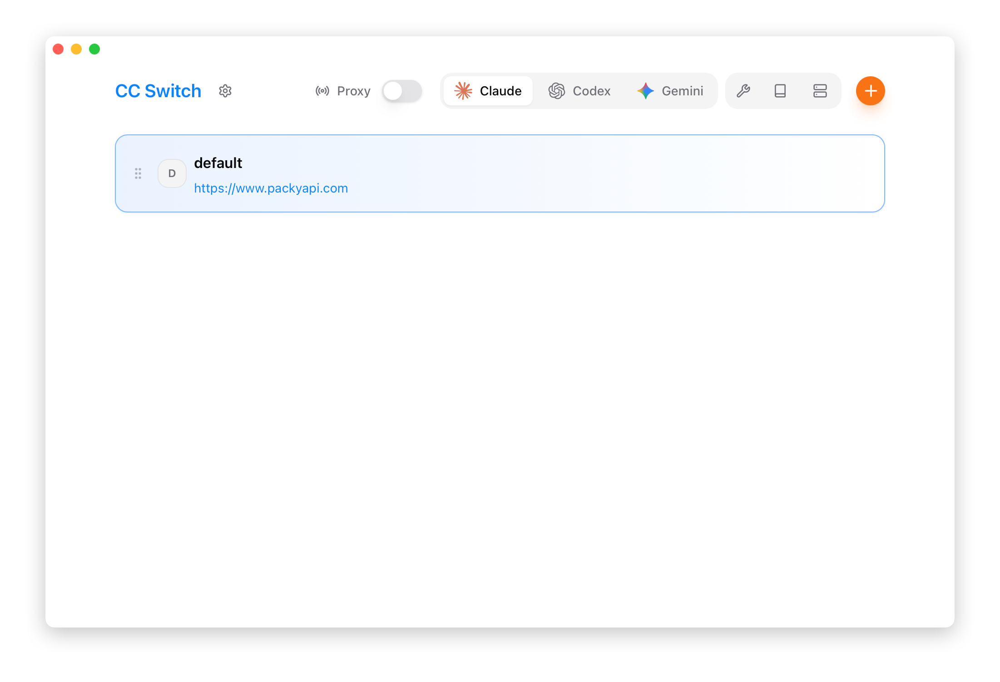
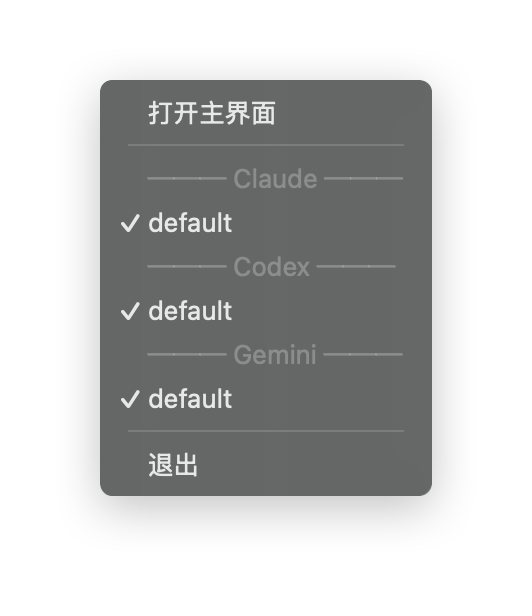

# 1.3 Interface Overview

## Main Interface Layout

## Top Navigation Bar

| # | Element | Description |
|---|---------|-------------|
| 1 | Logo | Click to visit the GitHub project page |
| 2 | Settings Button | Open the settings page (shortcut `Ctrl + ,`) |
| 3 | App Switcher | Switch between Claude / Codex / Pi |
| 4 | Feature Area | App-specific feature entry points |
| 5 | Add Button | Add a new provider |

### App Switcher

Click the dropdown menu to switch the currently managed application:

- **Claude** - Manage Claude Code configuration
- **Codex** - Manage Codex configuration
- **Pi** - Manage Pi providers (several can be enabled at the same time)

After switching, the provider list displays the configurations for the selected application. Which apps appear is controlled by the App Visibility setting.

### Feature Area Buttons

| Button | Function | Visibility |
|--------|----------|------------|
| Skills | Skill extension management | Claude / Codex / Pi |
| Prompts | System prompt management | Claude / Codex / Pi |
| MCP | MCP server management | Claude / Codex |

## Provider Cards

Each provider is displayed as a card, containing the following elements from left to right:

### Card Elements (Left to Right)

| # | Element | Icon | Description |
|---|---------|------|-------------|
| 1 | Drag Handle | ≡ | Hold and drag up/down to reorder providers |
| 2 | Provider Icon | - | Displays provider brand icon with customizable color |
| 3 | Provider Info | - | Name, notes/endpoint URL (clickable to open website) |
| 4 | Enable Button | - | Switch to this provider |
| 5 | Edit Button | - | Edit provider configuration |
| 6 | Duplicate Button | - | Duplicate provider (create a copy) |
| 7 | Open Terminal Button | >_ | Claude only: launch the CLI in a terminal that already has the active provider's credentials injected |
| 8 | Delete Button | - | Delete provider (disabled when currently active) |

> **Tip**: The action buttons area (4-8) appears on hover and is hidden by default to keep the interface clean.

Cards never show secret values. A provider that already has a key configured just shows a "configured" hint; the key itself is never echoed back into the UI.

### Button Details

| Button | State Changes | Notes |
|--------|---------------|-------|
| **Enable** | Shows checkmark and disables when active | Pi providers show "Add / Remove" and can be enabled alongside other Pi providers |
| **Edit** | Always available | Opens edit panel to modify configuration |
| **Duplicate** | Always available | Creates a copy with `copy` suffix |
| **Open Terminal** | Always available | Injects the environment variables directly when starting the terminal, so no reopen is needed |
| **Delete** | Semi-transparent/disabled when active | Must switch to another provider first |

### Card States

| State | Border Color | Description |
|-------|--------------|-------------|
| **Currently Active** | Blue border | The provider in use right now |
| **Normal** | Default border | Inactive provider |
| **Needs Key** | Warning badge | Keys are excluded from sync and export; after restoring from another device you must edit the provider and re-enter the API key before switching to it |

## System Tray

CC Switch displays an icon in the system tray, providing quick access to operations.

### Tray Menu Structure

### Menu Functions

| Menu Item | Function |
|-----------|----------|
| Open Main Window | Show and focus the main window |
| App Submenus | Collapsible submenus grouped by Claude/Codex/Pi (e.g., "Claude · PackyCode"), with the current provider shown in the title |
| Provider List | Inside each submenu, click to switch; currently active shows a checkmark |
| Lightweight Mode | Toggle checkbox to enter/exit tray-only mode |
| Quit | Fully exit the application |

> **Note**: Each tray submenu title shows the current provider name (e.g., "Claude · PackyCode"). Apps with no configured providers show a disabled "(no providers)" entry. Main-window app visibility is still controlled by the App Visibility setting.

### Multi-language Support

The tray menu supports four languages, automatically switching based on settings:

| Language | Open Main Window | Quit |
|----------|-----------------|------|
| Simplified Chinese | 打开主界面 | 退出 |
| Traditional Chinese | 開啟主介面 | 退出 |
| English | Open main window | Quit |
| Japanese | メインウィンドウを開く | 終了 |

### Lightweight Mode

The tray menu includes a **Lightweight Mode** toggle (checkbox). When enabled:

- The main window is closed to free up resources
- The app continues running in the system tray only
- You can still switch providers via the tray submenus

To exit Lightweight Mode, uncheck the toggle or click "Open main window" — the main window will be rebuilt and shown.

> ⚠️ **Note**: Switching providers from the tray also delivers credentials through user environment variables, so terminals that are already open must be reopened to pick up the new values. When you need them immediately, use "Open Terminal" on the card or in the main window.

### Use Cases

Switching providers via the tray menu doesn't require opening the main window, suitable for:

- Frequently switching providers
- Quick operations when the main window is minimized
- Managing configurations while running in the background
- Running in Lightweight Mode for minimal resource usage

## Settings Page

The settings page is divided into three tabs:

### General Tab

- Language settings (Simplified Chinese/Traditional Chinese/English/Japanese)
- Theme settings (System/Light/Dark)
- App visibility
- Skills storage location and sync mode
- Window behavior (launch on startup, close behavior)
- Terminal settings

### Advanced Tab

- Configuration directory settings
- Data import/export and backups
- Cloud sync (WebDAV / S3)
- Global outbound proxy
- Credential storage maintenance

### About Tab

- Version information and release notes
- Local environment check (CLI tool versions, install/upgrade)

## Keyboard Shortcuts

| Shortcut | Function |
|----------|----------|
| `Ctrl + ,` | Open Settings |
| `Ctrl + F` | Search providers |
| `Esc` | Close dialog/search |

## Search

Press `Ctrl + F` to open the search bar:

- Search by name, notes, or URL
- Real-time provider list filtering
- Press `Esc` to close search
