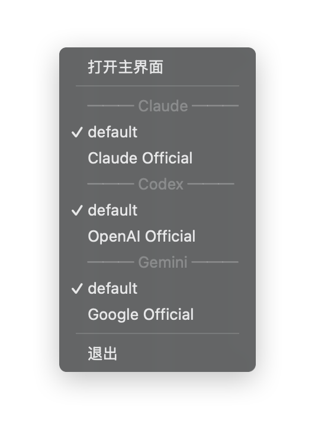

# 2.2 Switch Provider

## Switch from Main Interface

In the provider list, click the "Enable" button on the target provider card.

### Switching Flow

1. Click the "Enable" button
2. CC Switch reads the provider's key from Windows Credential Manager, writes the user environment variables, and rewrites the live configuration files
3. The card status changes to "Currently Active"
4. **Already open terminals must be reopened** before they can read the new variables

> ⚠️ If the provider has no key yet (for example it was just restored from a sync on another device), the switch is refused and you are asked to complete the API Key first.

**Don't want to reopen a terminal?** On the Claude tab, click "Open Terminal" on the provider card and CC Switch injects that provider's credentials straight into the terminal process it launches, so it works immediately. Codex and Pi still require a new terminal.

### Status Indicators

| Status | Display | Description |
|--------|---------|-------------|
| Currently Active | Blue border + label | The provider in use right now |
| Needs Key | Warning badge | Key missing (e.g. after a sync restore); edit the provider to complete it |
| Normal | Default style | Inactive provider |

## Quick Switch via System Tray

Quickly switch providers via the system tray without opening the main interface.

### Steps

1. Right-click the CC Switch icon in the system tray
2. Hover over the corresponding app submenu (e.g., "Claude · CurrentProvider")
3. Click the provider name you want to switch to
4. Switching completes with a brief tray notification

> ⚠️ Tray switching uses the same delivery path (user environment variables), so **already open terminals must be reopened here as well**.

### Tray Menu Structure

The tray menu is a set of **per-app hierarchical submenus**, with a dedicated submenu for each app:

| Submenu    | Description                                                    |
| ---------- | -------------------------------------------------------------- |
| Claude     | All Claude providers                                           |
| Codex      | All Codex providers                                            |
| Pi         | All Pi providers                                               |

**Benefits of the hierarchical submenus**:

- **Prevents menu overflow**: With many providers, a flat list would exceed screen height; per-app submenus scale naturally
- **Submenu title shows the currently active provider**: You know at a glance which provider Claude / Codex / Pi is using, without opening the submenu
- **Per-app isolation**: Switching Claude's provider doesn't disturb the Codex or Pi view

> **Tip**: The combination of background residency + Lightweight Mode + per-app submenus is especially suited for heavy users who frequently switch among multiple apps. See [1.5 Personalization → Lightweight Mode](../1-getting-started/1.5-settings.md).

## Activation Methods

Credentials for all three apps are delivered through **user environment variables**, so the common rule is: **only newly opened terminals see the new values**.

### Claude Code

- CC Switch writes `ANTHROPIC_AUTH_TOKEN` (or `ANTHROPIC_API_KEY`, depending on the provider's auth field) and `ANTHROPIC_BASE_URL` into `HKCU\Environment` and broadcasts `WM_SETTINGCHANGE`
- `~/.claude/settings.json` no longer contains these keys, so it cannot override the environment variables
- Close and reopen the terminal to apply

### Codex

- Third-party providers: CC Switch writes the `CC_SWITCH_CODEX_API_KEY` environment variable, and the matching `[model_providers.<id>]` table in `~/.codex/config.toml` carries only `env_key = "CC_SWITCH_CODEX_API_KEY"` plus `base_url`
- Official API key providers: writes `OPENAI_API_KEY`
- Close and reopen the terminal to apply

### Pi

- Each enabled Pi provider has its own variable `CC_SWITCH_PI_<KEY>_API_KEY`, and `~/.pi/agent/models.json` carries `apiKey: "$CC_SWITCH_PI_<KEY>_API_KEY"`
- Pi supports several providers enabled at the same time; adding or removing one only touches its own variables
- Restart the Pi session to see the change

## Configuration File Changes

When switching providers, CC Switch modifies the following.

### Claude

| Location | Change |
|----------|--------|
| `HKCU\Environment` (user environment variables) | Writes `ANTHROPIC_*`; never writes `HKLM` |
| `~/.claude/settings.json` | Receives the stripped configuration (non-sensitive env such as model names), **without** `ANTHROPIC_AUTH_TOKEN` / `ANTHROPIC_API_KEY` / `ANTHROPIC_BASE_URL` |

### Codex

| Location | Change |
|----------|--------|
| `HKCU\Environment` | Writes `CC_SWITCH_CODEX_API_KEY` (third-party) or `OPENAI_API_KEY` (official) |
| `~/.codex/config.toml` | Writes the `env_key` variable name and the active provider's `base_url`; no `experimental_bearer_token` |

> 💡 CC Switch no longer writes `~/.codex/auth.json`, so the sign-in state you established with `codex login` is left alone.

### Pi

| Location | Change |
|----------|--------|
| `HKCU\Environment` | Writes `CC_SWITCH_PI_<KEY>_API_KEY` (plus sensitive header variables) |
| `~/.pi/agent/models.json` | Writes the provider node, with `apiKey` as `$VARIABLE_NAME` and `baseUrl` as the real address |

> ℹ️ The `base_url` of Codex and Pi can only live in the live files (the corresponding CLIs do not support variable references in that field), and only for the currently active provider; the base URLs of other providers stay in Credential Manager.

## Handling Switch Failures

If switching fails, possible reasons:

### Missing Key

The provider never had an API Key saved (left blank when created, or restored from another device via sync).

**Solution**: Edit the provider, enter the key again and save.

### Environment Variable Conflict

A variable of the same name already exists in the user environment, was not written by CC Switch, and holds a different value. CC Switch shows a conflict dialog first that reveals only the last 4 characters of the other variable.

**Solution**: Confirm "Take over (overwrite)" and run the switch again, or cancel the switch and handle it yourself. Note that taking over replaces the original value with no backup kept. See [5.4 Environment Variable Conflicts](../5-faq/5.4-env-conflict.md).

### Configuration File Is Locked

Another program is using the configuration file.

**Solution**: Close the running CLI tool and try switching again.

### Insufficient Permissions

No write permission to the configuration file.

**Solution**: Check the permission settings of the configuration directory.

### Invalid Configuration Format

The provider's JSON configuration has format errors.

**Solution**: Edit the provider, check and fix the JSON format.
