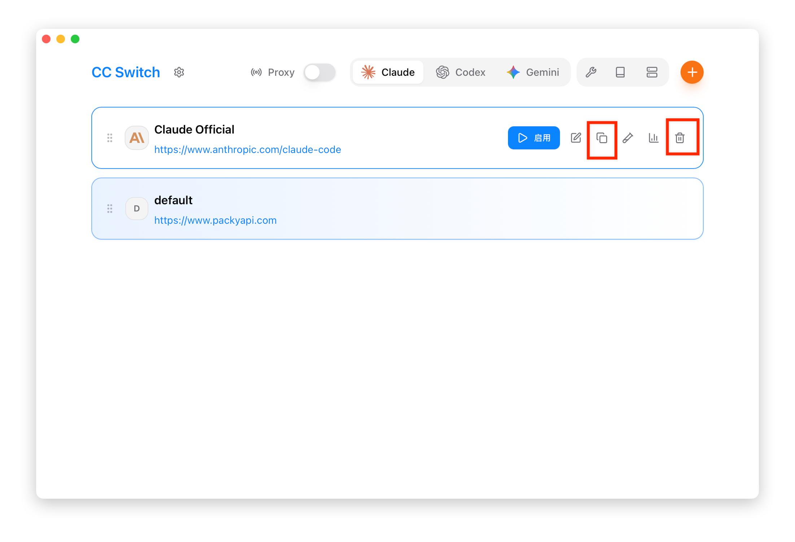

# 2.4 Sort & Duplicate

## Drag to Reorder

Adjust the display order of providers by dragging.

### Steps

1. Move the mouse to the **≡** drag handle on the left side of the provider card
2. Hold the left mouse button
3. Drag up or down to the target position
4. Release the mouse to complete reordering

### Reorder Uses

- **Prioritize frequently used**: Place frequently used providers at the top of the list
- **Tray and dropdown ordering**: The tray submenus and the add/switch lists follow the same order

## Duplicate Provider

Quickly create a copy of a provider, useful for:

- Creating variations based on existing configurations
- Backing up current configurations
- Creating test configurations

### Steps

1. Hover over the provider card to reveal action buttons
2. Click the "Duplicate" button
3. A copy is automatically created with a `copy` name suffix
4. Edit the copy to modify the configuration

### Duplicated Content

Duplication creates a copy of the configuration, including:

| Content | Duplicated |
|---------|------------|
| Name | Yes (with `copy` suffix) |
| Configuration | Yes (without the key and the endpoint URL) |
| Website Link | Yes |
| Icon and color | Yes |
| Sort Position | Inserted below the original provider |

> ⚠️ **Note**: The API Key and the endpoint URL are stored in Windows Credential Manager and are bound to the provider ID, so they are **not** duplicated. After the copy is created you must edit it and supply a key before it can be enabled.

### After Duplication

After duplication, you typically need to modify:

1. **Name**: Change to a meaningful name
2. **API Key**: Required — the copy carries no key
3. **Endpoint URL**: Must be entered again as well

## Delete Provider

### Steps

1. Hover over the provider card to reveal action buttons
2. Click the "Delete" button
3. Confirm deletion

### Deletion Confirmation

A confirmation dialog appears before deletion, showing:

- Provider name
- Warning that deletion cannot be undone

### Deletion Restrictions

- **Currently active provider**: Can be deleted, but it is recommended to switch to another provider first

### Cleaned Up on Deletion

- The provider's entries in Windows Credential Manager (API key, endpoint URL, sensitive environment variables)
- The user environment variables written by CC Switch (followed by a `WM_SETTINGCHANGE` broadcast)

Variables of the same name that you set elsewhere yourself are left untouched. If a credential entry fails to delete, only a warning is logged and the deletion is not blocked; leftovers can be cleaned up under "Settings > Advanced > Credential Manager Maintenance".

