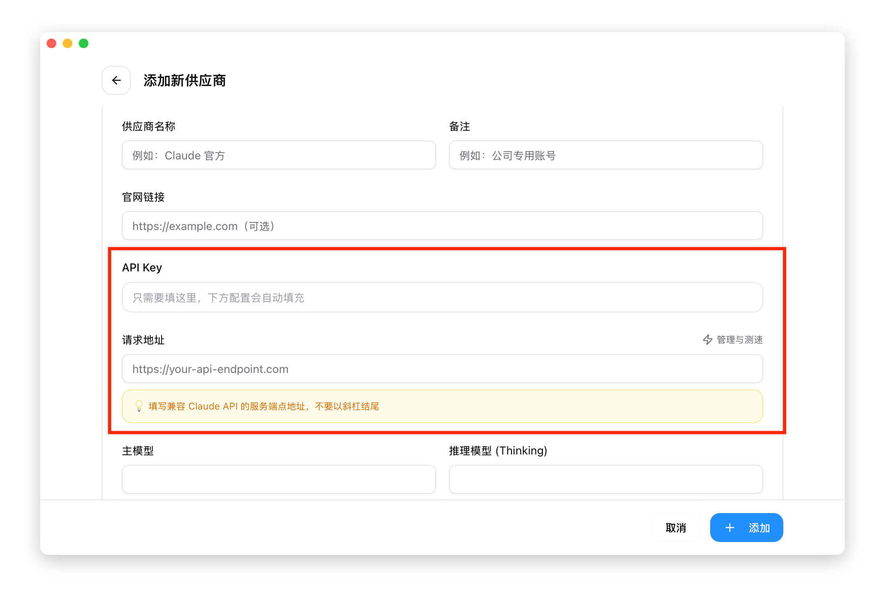
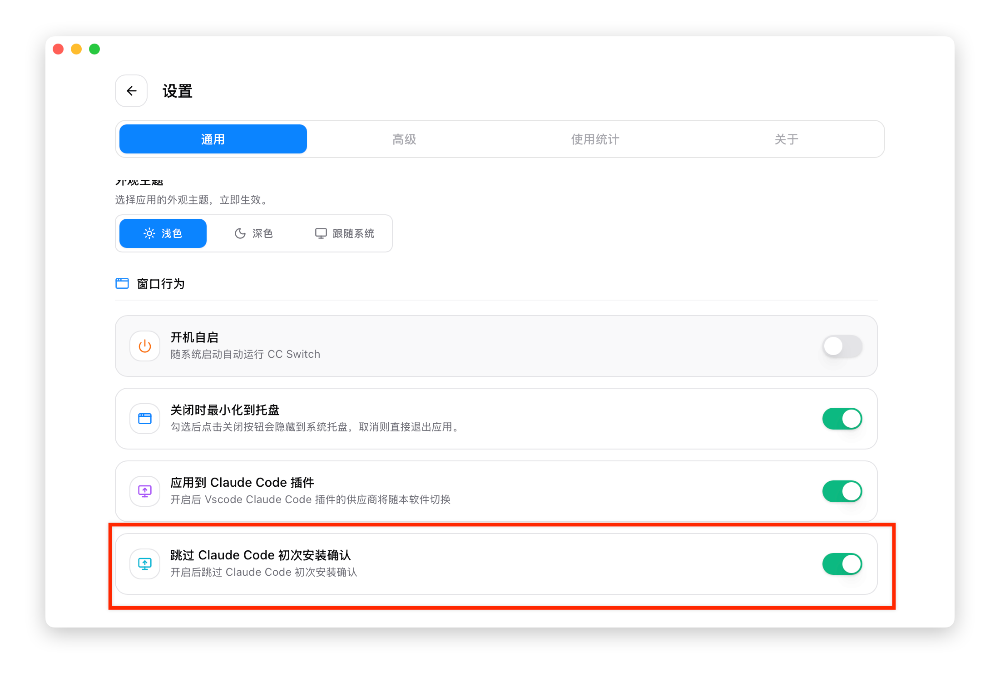

# 1.4 クイックスタート

このセクションでは、5 分で初回設定を完了する方法を説明します。

## ステップ 1：プロバイダーの追加

1. メイン画面右上の **+** ボタンをクリック
2. 「プリセット」ドロップダウンからプロバイダーを選択
   - よく使われるプリセット：智谱 GLM、MiniMax、DeepSeek、Kimi、PackyCode
   - または「カスタム」を選択して手動設定
3. **API Key** を入力
4. 「追加」をクリック



> 💡 **ヒント**：プリセットではエンドポイントアドレスが自動入力されるため、API Key のみ入力すれば使用できます。鍵は Windows 資格情報マネージャに書き込まれ、データベースや設定ファイルには保存されません。

## ステップ 2：プロバイダーの切り替え

追加が完了すると、プロバイダーがリストに表示されます。

**方法 1：メイン画面で切り替え**
- プロバイダーカードの「有効化」ボタンをクリック

**方法 2：トレイで素早く切り替え**
- システムトレイアイコンを右クリック
- プロバイダー名を直接クリック

> ⚠️ **注意**：切り替えはユーザーレベルの環境変数（`HKCU\Environment`）へ書き込む形で認証情報を供給します。**すでに開いているターミナルには新しい値が見えないため、ターミナルを開き直す必要があります**。すぐに使いたい場合は、プロバイダーカードの「ターミナルを開く」をクリックしてください。CC Switch が変数をそのターミナルプロセスへ直接注入するため、開き直しは不要です。

## ステップ 3：反映方法

プロバイダーを切り替えた後、各 CLI ツールの反映方法は異なります：

| アプリ | 反映方法 |
|------|----------|
| Claude Code | ターミナルの再起動が必要（新しい環境変数が読み込まれる） |
| Codex | ターミナルの再起動が必要 |
| Pi | Pi セッションを開き直せば反映される。Pi は複数プロバイダーの同時有効化に対応 |

> 💡 CC Switch 内の「ターミナルを開く」から起動したターミナルは開き直し不要ですぐに反映されます。

### Claude Code の初回インストール時の注意

Claude Code を初めて起動するときに**ログイン**の要求や初期化ガイドが表示される場合は、CC Switch で「Claude Code の初回確認をスキップ」オプションを有効にしてください：

1. CC Switch の「設定 → 一般」を開く
2. 「Claude Code の初回確認をスキップ」スイッチをオンにする
3. Claude Code を再起動



> ⚠️ **注意**：このオプションは `~/.claude.json` に `hasCompletedOnboarding = true` を書き込み、公式の初回ガイドフローをスキップします。

## 設定の確認

ターミナルを開き直した後、対応する CLI ツールを起動して簡単な質問でテストします：

```bash
# Claude Code - 起動後にテスト質問を入力
claude
> こんにちは、簡単に自己紹介してください

# Codex - 起動後にテスト質問を入力
codex
> こんにちは、簡単に自己紹介してください

# Pi - 起動後にテスト質問を入力
pi
> こんにちは、簡単に自己紹介してください
```

AI が正常に回答すれば、設定は成功です。

## 次のステップ

基本設定が完了しました。次に以下のことができます：

- [プロバイダーの追加](../2-providers/2.1-add.md) - 複数のプロバイダーを設定して簡単に切り替え
- [MCP サーバーの設定](../3-extensions/3.1-mcp.md) - AI ツールの機能を拡張
- [システムプロンプトの設定](../3-extensions/3.2-prompts.md) - AI の動作をカスタマイズ

## よくある質問

### 切り替えても反映されない場合

まずターミナルを開き直してください。切り替え時に CC Switch が書き込むのはユーザーレベルの環境変数で、実行中のターミナルプロセスは古い値を引き継いでいます。それでも反映されない場合は、`~/.claude/settings.local.json` やプロジェクト単位の `.claude/settings.json` に `env.ANTHROPIC_*` がないか確認してください。これらはプロセスの環境変数より優先されるため、CC Switch はこれらのファイルを書き換えず、競合の警告のみを表示します。詳細は [5.4 環境変数の競合](../5-faq/5.4-env-conflict.md) を参照してください。

### プリセットが見つからない場合

プロバイダーがプリセットリストにない場合は、「カスタム」を選択して手動設定してください。設定形式については [プロバイダーの追加](../2-providers/2.1-add.md) を参照してください。

### 公式ログインに戻すには

「公式ログイン」プリセット（Claude / Codex）を選択し、ターミナルを開き直してから CLI 自身のログインフローに従ってください。CC Switch は OAuth ログインを管理せず、Codex の `auth.json` にあるご自身の ChatGPT ログイン状態も上書きしません。
