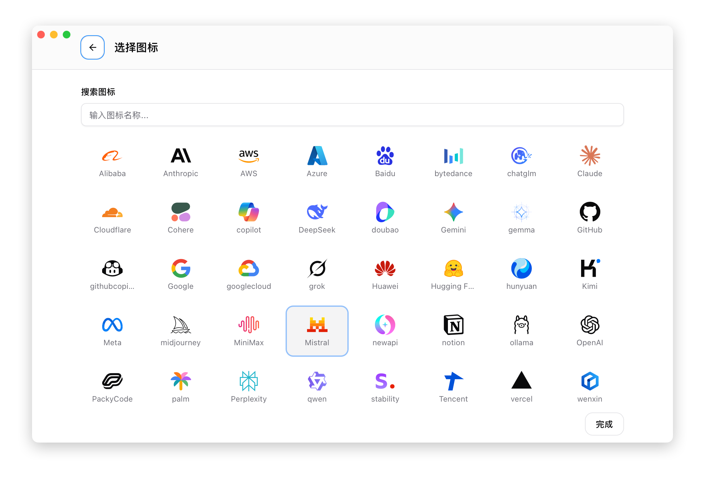

# 2.3 プロバイダーの編集

## 編集パネルを開く

1. 編集したいプロバイダーカードを見つける
2. カードにマウスをホバーして操作ボタンを表示
3. 「編集」ボタンをクリック

## 編集可能な内容

### 基本情報

| フィールド | 説明 |
|------|------|
| 名前 | プロバイダーの表示名 |
| メモ | 付加情報 |
| Web サイトリンク | プロバイダーの公式サイトまたはコンソールアドレス |
| アイコン | カスタムアイコンと色 |

### アイコンのカスタマイズ

CC Switch は豊富なアイコンカスタマイズ機能を提供しています：

#### アイコン選択画面

1. アイコンエリアをクリックしてアイコン選択画面を開く
2. 検索ボックスで名前からアイコンを検索
3. クリックしてアイコンを選択

アイコンライブラリには一般的な AI サービスプロバイダーと技術アイコンが含まれており、以下をサポートします：
- 名前によるあいまい検索
- アイコン名のツールチップ表示
- 選択結果のリアルタイムプレビュー



### 設定情報

JSON 形式の設定内容で、モデル名や機密でない環境変数などを含みます。

> ⚠️ **注意**：API key、エンドポイントアドレス、および機密と判定された環境変数は**この JSON の中には含まれません**。それらは Windows 資格情報マネージャに保存され、フォームに入力した値は保存時に抽出されます。

### 現在有効なプロバイダーの編集

現在有効なプロバイダーを編集する場合、特別な「バックフィル」機能があります：

1. 編集パネルを開くと、live 設定ファイルから最新の内容を読み取る
2. CLI ツールで手動で設定を変更した場合、その変更が同期される
3. 保存すると、変更が live 設定ファイルに書き込まれる

> 💡 バックフィルが対象するのは、鍵が除去済みの設定部分だけです。資格情報マネージャ内のエントリには影響せず、live ファイル側の値で逆に上書きされることもありません。

これにより、CC Switch と CLI ツールの設定が常に同期されます。

## モデル自動取得

プロバイダーの編集時に、プロバイダーのエンドポイントから利用可能なモデルリストを自動取得できます：

1. API Key とエンドポイントアドレスが入力されていることを確認
2. モデル入力フィールドの横にある **モデル取得** ボタン（ダウンロードアイコン）をクリック
3. グループ化されたドロップダウンからモデルを選択

詳しくは [2.1 プロバイダーの追加 - モデル自動取得](./2.1-add.md#モデル自動取得) をご覧ください。

## 共通設定クイックトグル（Claude）

Claude プロバイダーの編集時、JSON エディタの上部にツール検索、Claude Code 自身のバックグラウンド更新の無効化、チームメイト、最大強度思考などの共通設定のクイックトグルスイッチが利用できます。詳しくは [2.1 プロバイダーの追加 - Claude 共通設定クイックトグル](./2.1-add.md#claude-共通設定クイックトグル) をご覧ください。

## API Key の変更

プロバイダーの編集時に、**API Key** 入力ボックスから直接変更できます：

1. プロバイダーカードの「編集」ボタンをクリック
2. 「API Key」入力ボックスに新しいキーを入力
3. 「保存」をクリック

> ⚠️ **注意**：平文の鍵を残さない設計のため、保存済みの鍵は入力ボックスに**再表示されません**——入力欄は空欄のまま「設定済み」の通知だけを表示します。空欄のまま保存した場合は元の値が維持されます。値を消したい場合は明示的にそのフィールドをクリアしてください。新しい値を入力している間、右側の目のアイコンは**入力中のこのテキスト**の表示/非表示だけを切り替えます。

## エンドポイントアドレスの変更

プロバイダーの編集時に、**エンドポイントアドレス** 入力ボックスから直接変更できます：

1. プロバイダーカードの「編集」ボタンをクリック
2. 「エンドポイントアドレス」入力ボックスに新しい URL を入力
3. 「保存」をクリック

### エンドポイントアドレスの形式

| アプリ | 形式の例 |
|------|----------|
| Claude | `https://api.example.com` |
| Codex | `https://api.example.com/v1` |
| Pi | `https://api.example.com/v1` |

> 💡 エンドポイントアドレスも同様に Windows 資格情報マネージャに保存されます。切り替え後、Claude のエンドポイントは `ANTHROPIC_BASE_URL` 環境変数として供給され、Codex / Pi のエンドポイントは各 live 設定ファイルの有効なエントリに書き込まれます（この 2 つの CLI はこのフィールドでの変数参照に対応していません）。

## JSON エディタ

設定は JSON 形式を使用し、エディタは以下を提供します：

- シンタックスハイライト
- フォーマット検証
- エラー通知

### よくあるエラー

**引用符の欠落**：
```json
// ❌ 間違い
{ env: { KEY: "value" } }

// ✅ 正しい
{ "env": { "KEY": "value" } }
```

**余分なカンマ**：
```json
// ❌ 間違い
{ "env": { "KEY": "value", } }

// ✅ 正しい
{ "env": { "KEY": "value" } }
```

**閉じ括弧の欠落**：
```json
// ❌ 間違い
{ "env": { "KEY": "value" }

// ✅ 正しい
{ "env": { "KEY": "value" } }
```

## 保存と反映

1. 「保存」ボタンをクリック（鍵とエンドポイントアドレスはこのステップで Windows 資格情報マネージャへ書き込まれます）
2. フォームが非ブロッキングな問題を検出した場合、「それでも保存」の確認が表示されます。確認すると保存できます
3. 現在有効なプロバイダーの場合、設定は即座に live ファイルに書き込まれ、環境変数も更新されます
4. ターミナルを開き直してから、CLI が新しい環境変数を読み込みます

## 編集のキャンセル

「キャンセル」ボタンをクリックするか `Esc` キーを押して編集パネルを閉じると、すべての変更は保存されません。
