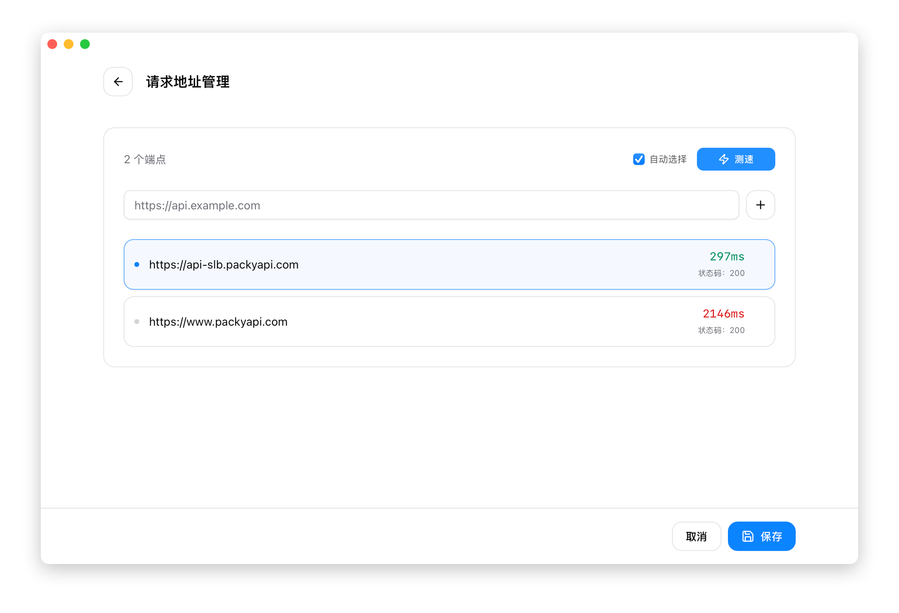

# 2.1 添加供应商

## 打开添加面板

点击主界面右上角的 **+** 按钮，打开添加供应商面板。

面板面向当前选中的应用（Claude Code / Codex / Pi）。

## 使用预设添加

预设是预先配置好的供应商模板，只需填写 API Key 即可使用。

### 操作步骤

1. 在「预设」下拉框中选择供应商
2. 名称和端点会自动填充
3. 填写你的 **API Key**
4. （可选）填写备注
5. 点击「添加」

### 常用预设

#### Claude 预设

| 预设名称 | 说明 |
|----------|------|
| Claude 官方 | 使用 Anthropic 官方账号登录 |
| DeepSeek | DeepSeek 模型 |
| 智谱 GLM | 智谱 AI 的 GLM 模型 |
| 智谱 GLM en | 智谱 AI（英文版） |
| 百炼 | 阿里云百炼（通义千问） |
| Kimi | Moonshot Kimi 模型 |
| Kimi For Coding | Kimi 编程专用模型 |
| StepFun | 阶跃星辰 Step模型 |
| ModelScope | 魔搭社区 |
| KAT-Coder | KAT-Coder 模型 |
| Longcat | Longcat AI |
| MiniMax | MiniMax 模型 |
| MiniMax en | MiniMax（英文版） |
| 火山 豆包AI | 豆包 Seed 模型 |
| BaiLing | 百灵 AI |
| AiHubMix | AiHubMix 聚合服务 |
| SiliconFlow | 硅基流动 |
| SiliconFlow en | 硅基流动（英文版） |
| DMXAPI | DMXAPI 中转服务 |
| PackyCode | PackyCode 中转服务 ⭐ |
| Cubence | Cubence 服务 |
| AIGoCode | AIGoCode 服务 |
| RightCode | RightCode 服务 |
| AICodeMirror | AICodeMirror 服务 |
| OpenRouter | 聚合路由服务 |
| Nvidia | Nvidia AI 服务 |
| Xiaomi MiMo | 小米 MiMo 模型 |

> ⭐ 标注为官方合作伙伴。预设列表可能随版本更新，以应用内实际显示为准。

#### Claude Desktop 预设

Claude Desktop 面板内置从 Claude Code 预设目录转换而来的供应商预设。添加时可选择：

- **直连模式**：供应商原生支持 Anthropic Messages API，且模型名是 Claude Desktop 可识别的三档角色 ID（`claude-sonnet-*` / `claude-opus-*` / `claude-haiku-*`），Claude Desktop 可直接访问
- **模型映射模式**：模型名非三档角色 ID（旧式 Claude ID、或 DeepSeek / Kimi 等非 Claude 模型）通过 CC Switch 本地网关映射为 Sonnet / Opus / Haiku 路由
- **Claude Desktop Official**：恢复 Claude Desktop 官方登录模式


#### Codex 预设

Codex 预设按上游协议分两类。

**原生 Responses 协议**（可直连或经标准代理转发）：

| 预设名称 | 说明 |
|----------|------|
| OpenAI 官方 | 使用 OpenAI 官方账号登录 |
| Azure OpenAI | Azure OpenAI 服务 |
| AiHubMix | AiHubMix 聚合服务 |
| DMXAPI | DMXAPI 中转服务 |
| PackyCode | PackyCode 中转服务 |
| OpenRouter | 聚合路由服务 |
| Cubence / AIGoCode / RightCode / AICodeMirror 等 | 各类中转服务 |

**Chat Completions 协议**：

| 预设名称 | 说明 |
|----------|------|
| DeepSeek | DeepSeek 模型 |
| 智谱 GLM / GLM en | 智谱 AI 的 GLM 模型 |
| Kimi / Kimi For Coding | Moonshot Kimi 模型 |
| MiniMax / MiniMax en | MiniMax 模型 |
| StepFun / StepFun en | 阶跃星辰 Step 模型 |
| 百度千帆 Coding Plan | 百度千帆编程套餐 |
| 百炼 | 阿里云百炼（通义千问） |
| ModelScope | 魔搭社区 |
| Longcat | Longcat AI |
| 百灵 (BaiLing) | 百灵 AI |
| 小米 MiMo / MiMo Token Plan | 小米 MiMo 模型 |
| 火山 Agentplan | 火山引擎 Agent Plan |
| BytePlus | BytePlus 服务 |
| 火山 豆包AI | 豆包 Seed 模型 |
| SiliconFlow / SiliconFlow en | 硅基流动 |
| Novita AI | Novita AI 服务 |
| Nvidia | Nvidia AI 服务 |

> 💡 选择 Chat Completions 类预设时，「需要本地路由映射」开关和模型映射表会自动配置好，无需手动设置。预设列表持续更新，以应用内实际显示为准。

#### Gemini 预设

| 预设名称 | 说明 |
|----------|------|
| Google 官方 | 使用 Google OAuth 登录 |
| PackyCode | PackyCode 中转服务 |
| Cubence | Cubence 服务 |
| AIGoCode | AIGoCode 服务 |
| AICodeMirror | AICodeMirror 服务 |
| OpenRouter | 聚合路由服务 |
| 自定义 | 手动配置所有参数 |

#### OpenCode 预设

| 预设名称 | 说明 |
|----------|------|
| DeepSeek | DeepSeek 模型 |
| 智谱 GLM | 智谱 AI 的 GLM 模型 |
| 智谱 GLM en | 智谱 AI（英文版） |
| 百炼 | 阿里云百炼 |
| Kimi k2.5 | Moonshot Kimi-k2.5 模型 |
| Kimi For Coding | Kimi 编程专用模型 |
| StepFun | 阶跃星辰 Step模型 |
| ModelScope | 魔搭社区 |
| KAT-Coder | KAT-Coder 模型 |
| Longcat | Longcat AI |
| MiniMax | MiniMax 模型 |
| MiniMax en | MiniMax（英文版） |
| 火山 豆包AI | 豆包 Seed 模型 |
| BaiLing | 百灵 AI |
| Xiaomi MiMo | 小米 MiMo 模型 |
| AiHubMix | AiHubMix 聚合服务 |
| DMXAPI | DMXAPI 中转服务 |
| OpenRouter | 聚合路由服务 |
| Nvidia | Nvidia AI 服务 |
| PackyCode | PackyCode 中转服务 |
| Cubence | Cubence 服务 |
| AIGoCode | AIGoCode 服务 |
| RightCode | RightCode 服务 |
| AICodeMirror | AICodeMirror 服务 |
| OpenAI Compatible | OpenAI 兼容接口 |
| Oh My OpenCode | Oh My OpenCode 服务 |

> 💡 预设列表持续更新中，以应用内实际显示为准。

#### OpenClaw 预设

| 预设名称 | 说明 |
|----------|------|
| DeepSeek | DeepSeek 模型 |
| 智谱 GLM | 智谱 AI 的 GLM 模型 |
| 智谱 GLM en | 智谱 AI（英文版） |
| Qwen Coder | 通义千问编码模型 |
| Kimi k2.5 | Moonshot Kimi-k2.5 模型 |
| Kimi For Coding | Kimi 编程专用模型 |
| StepFun | 阶跃星辰 Step模型 |
| MiniMax | MiniMax 模型 |
| MiniMax en | MiniMax（英文版） |
| KAT-Coder | KAT-Coder 模型 |
| Longcat | Longcat AI |
| 火山 豆包AI | 豆包 Seed 模型 |
| BaiLing | 百灵 AI |
| Xiaomi MiMo | 小米 MiMo 模型 |
| AiHubMix | AiHubMix 聚合服务 |
| DMXAPI | DMXAPI 中转服务 |
| OpenRouter | 聚合路由服务 |
| ModelScope | 魔搭社区 |
| SiliconFlow | 硅基流动 |
| SiliconFlow en | 硅基流动（英文版） |
| Nvidia | Nvidia AI 服务 |
| PackyCode | PackyCode 中转服务 |
| Cubence | Cubence 服务 |
| AIGoCode | AIGoCode 服务 |
| RightCode | RightCode 服务 |
| AICodeMirror | AICodeMirror 服务 |
| AICoding | AICoding 服务 |
| CrazyRouter | CrazyRouter 服务 |
| SSSAiCode | SSSAiCode 服务 |
| AWS Bedrock | AWS Bedrock 服务 |
| OpenAI Compatible | OpenAI 兼容接口 |

## 自动获取模型

添加或编辑供应商时，可以自动从供应商端点发现可用模型列表，免去手动复制粘贴模型 ID 的繁琐流程。

1. 确保已填写 **API Key** 和 **端点地址**
2. 点击模型输入框旁的 **获取模型** 按钮（下载图标）
3. CC Switch 使用配置的 API Key 调用 OpenAI 兼容的 `/v1/models` 端点
4. 从按类别分组的下拉菜单中选择模型

此功能覆盖 **Claude Code / Claude Desktop / Codex / Gemini / OpenCode / OpenClaw / Hermes** 中带模型字段的供应商表单，适用于支持 `/v1/models` 端点的供应商。Codex OAuth 类供应商会按需从 ChatGPT Codex 后端获取实时模型列表。

**常见错误**：
- **认证失败（401/403）**：检查你的 API Key 是否正确
- **端点不支持（404/405）**：该供应商未提供 `/v1/models` 端点，需手动填写模型 ID
- **解析失败**：返回内容不符合 OpenAI 兼容格式
- **超时**：端点响应缓慢，请稍后重试或检查网络

## 自定义配置

选择「自定义」预设后，需要手动编辑 JSON 配置。

### Claude 配置格式

```json
{
  "env": {
    "ANTHROPIC_API_KEY": "your-api-key",
    "ANTHROPIC_BASE_URL": "https://api.example.com"
  }
}
```

| 字段 | 必填 | 说明 |
|------|------|------|
| `ANTHROPIC_API_KEY` | 是 | API 密钥 |
| `ANTHROPIC_BASE_URL` | 否 | 自定义端点地址 |
| `ANTHROPIC_AUTH_TOKEN` | 否 | 替代 API_KEY 的认证方式 |

### Codex 配置格式

Codex 使用两个配置文件：

**1. auth.json**（`~/.codex/auth.json`）- 存储 API 密钥：

```json
{
  "OPENAI_API_KEY": "your-api-key"
}
```

**2. config.toml**（`~/.codex/config.toml`）- 存储模型和端点配置：

```toml
# 基础配置
model_provider = "custom"
model = "gpt-5.2"
model_reasoning_effort = "high"
disable_response_storage = true

# 自定义供应商配置
[model_providers.custom]
name = "custom"
base_url = "https://api.example.com/v1"
wire_api = "responses"
requires_openai_auth = true
```

**auth.json 字段说明**：

| 字段 | 必填 | 说明 |
|------|------|------|
| `OPENAI_API_KEY` | 是 | API 密钥 |

**config.toml 字段说明**：

| 字段 | 必填 | 说明 |
|------|------|------|
| `model_provider` | 是 | 模型提供商名称（需与 `[model_providers.xxx]` 匹配） |
| `model` | 是 | 使用的模型（如 `gpt-5.2`、`gpt-4o`） |
| `model_reasoning_effort` | 否 | 推理强度：`low` / `medium` / `high` |
| `disable_response_storage` | 否 | 是否禁用响应存储 |
| `base_url` | 是 | API 端点地址 |
| `wire_api` | 否 | API 协议类型（通常为 `responses`） |
| `requires_openai_auth` | 否 | 是否使用 OpenAI 认证方式 |


## 导入供应商

CC Switch 支持从数据库备份导入供应商配置：

### 数据库备份导入

从 SQL 备份文件批量导入：

1. 打开「设置 → 高级 → 数据管理」
2. 点击「选择文件」
3. 选择之前导出的 `.sql` 备份文件
4. 点击「导入」
5. 确认覆盖现有配置

**导入内容**：
- 所有供应商配置
- MCP 服务器配置
- Prompts 预设
- 用量日志

> ⚠️ **注意**：导入会覆盖现有数据库，建议先导出当前配置作为备份。导出的文件名格式为 `cc-switch-export-{时间戳}.sql`。

## 高级选项

### API 格式（仅 Claude）

添加使用第三方 API 的 Claude 供应商时，可能需要在高级选项中选择正确的 **API 格式**：

| 格式 | 说明 | 适用场景 |
|------|------|----------|
| **Anthropic Messages** | 原生 Anthropic API 格式（默认） | 直接 Anthropic API 或兼容代理 |
| **OpenAI Chat Completions** | OpenAI Chat API 格式，由代理自动转换 | 供应商仅支持 OpenAI Chat 格式 |
| **OpenAI Responses API** | OpenAI Responses API 格式，由代理自动转换 | 供应商仅支持 OpenAI Responses 格式 |


当配置了非默认 API 格式时，高级选项区域会自动展开。

### 完整 URL 端点模式

v3.13.0 起新增的高级选项。默认情况下，CC Switch 会把配置的 `base_url` 视作**前缀**，再在其后拼接 `/v1/chat/completions` 等固定路径。对于部分厂商（如需要非标准 URL 布局的第三方服务），这种拼接方式会导致请求失败。

**启用方式**：

1. 编辑供应商，展开「高级选项」
2. 勾选 **完整 URL 模式** 复选框
3. 将**完整的上游端点**（而非前缀）填入 `base_url`

**示例对比**：

| 模式                    | `base_url` 填写                                  | 实际请求目标                                     |
| ----------------------- | ------------------------------------------------ | ------------------------------------------------ |
| 默认（前缀拼接）        | `https://api.example.com`                        | `https://api.example.com/v1/chat/completions`    |
| **完整 URL 模式**       | `https://api.example.com/custom/path/messages`   | `https://api.example.com/custom/path/messages`   |

**适用场景**：
- 供应商要求使用非标准路径（不是 `/v1/chat/completions`）
- 供应商有多层级路径结构
- 厂商专属的 API 网关路径

> 💡 **提示**：代理转发和 Stream Check 都会遵循「完整 URL 模式」配置，因此启用后无需额外调整。如果关闭此选项，路径拼接恢复为默认行为。

### Claude 通用配置快捷开关

编辑 Claude 供应商时，JSON 编辑器上方提供一组 **快捷开关**：

| 开关 | 效果 | 配置变更 |
|------|------|----------|
| **隐藏署名** | 清除提交/PR 的署名元数据 | 设置 `attribution: {commit: "", pr: ""}` |
| **启用 Teammates** | 启用 Agent 团队功能 | 设置 `env.CLAUDE_CODE_EXPERIMENTAL_AGENT_TEAMS = "1"` |
| **启用工具搜索** | 启用工具搜索功能 | 设置 `env.ENABLE_TOOL_SEARCH = "true"` |
| **最大强度思考** | 将 effort 级别设为 max | 设置 `env.CLAUDE_CODE_EFFORT_LEVEL = "max"` |
| **禁用自动更新** | 阻止 Claude Code 自动更新 | 设置 `env.DISABLE_AUTOUPDATER = "1"` |
| **禁用 Artifact 工具** | 不把 Artifact 工具放进请求的 tools 数组（部分第三方网关会因其 schema 校验失败而对每个请求返回 400） | 设置 `env.CLAUDE_CODE_DISABLE_ARTIFACT = "1"` |

取消勾选开关时，对应的配置项会被完全移除。更改会实时反映在 JSON 编辑器中。

此外，**应用通用配置** 复选框可将全局配置片段合并到供应商中。点击 **编辑通用配置** 可自定义共享的配置片段。

### Codex 1M 上下文窗口

添加 Codex 供应商时，提供 **启用 1M 上下文窗口** 开关：

- **启用时**：在 config.toml 中设置 `model_context_window = 1000000` 并自动填充 `model_auto_compact_token_limit = 900000`
- **禁用时**：移除这两个字段

开关开启后显示的文本框可自定义自动压缩限制值。v3.15.0 起，该开关仅在新增 Codex 供应商时显示；编辑已有供应商时可通过高级配置直接调整相关字段。

### 自定义图标

点击名称左侧的图标区域，可以：

- 选择预设图标
- 自定义图标颜色

### 网站链接

填写供应商的官网或控制台地址，方便快速访问：

- 点击供应商卡片的链接图标可直接打开
- 用于查看余额、获取 API Key 等

### 备注

添加备注信息，如：

- 账号用途（个人/工作）
- 套餐信息
- 到期时间

备注会显示在供应商卡片上，也支持搜索。

### 端点测速

添加供应商后，可以对 API 端点进行速度测试：

1. 点击供应商卡片的「测速」按钮
2. 在测速面板中添加多个端点 URL
3. 点击「测速」执行测试
4. 选择延迟最低的端点

**测速结果**：
- 🟢 绿色：延迟 < 500ms（优秀）
- 🟡 黄色：延迟 500-1000ms（一般）
- 🔴 红色：延迟 > 1000ms（较慢）


